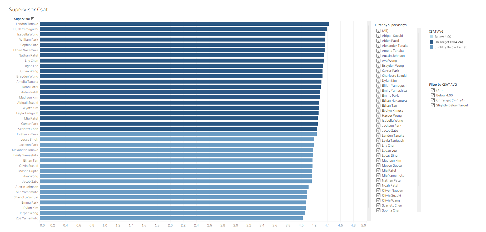

# Customer-Satisfaction-Improvement-Project

**Author:** Lucrezia Biancamaria Scarfo  

---

## Objective

This project presents a comprehensive analysis of **Customer Satisfaction (CSAT)** based on data collected between **July 28, 2023, and August 31, 2023**.  

The primary goals are:  
- **Identify opportunities for CSAT improvement** and uncover the key drivers behind lower satisfaction scores.  
- **Deliver a practical, interactive Tableau dashboard** that empowers managers and supervisors to monitor performance and provide targeted assistance at both the team and individual agent levels.  

---

## Dataset Used

### E-Commerce Customer Service Satisfaction  
- **Description:** Contains CSAT survey responses linked to e-commerce customer service interactions. Includes information such as ticket ID, support category, agent details, and customer satisfaction scores.  
- **Source:**  
  [Kaggle Dataset – E-Commerce Customer Service Satisfaction](https://www.kaggle.com/datasets/ddosad/ecommerce-customer-service-satisfaction/data)  
- **Author:** Kaggle user *ddosad*

---

## Data Preparation and Cleaning

### General Data Cleaning

1. **Initial Data Validation**  
   - The raw dataset contained **85,907 rows**, but only **85,895 rows** were imported into MySQL — a difference of 12 rows (**0.01%**).  
   - Given the negligible proportion, analysis proceeded without adjustment.  
   - In the `order_id` column, no NULL values were present; however, **18,230 entries** consisted of empty or whitespace-only strings, highlighting the need for cleaning.  

2. **Character and Whitespace Standardization**  
   - Standardized character sets and removed hidden whitespace.  
   - Temporarily switched table collation to **latin1_swedish_ci** to treat a broader set of characters as whitespace compared to **utf8mb4_unicode_ci**.  
   - Backed up data and performed **row-count and corruption checks** before and after the switch to prevent misinterpretation.  
   - Applied `TRIM` and nested `REPLACE` functions to remove **non-breaking spaces (CHAR(160))**, tabs, line feeds, and carriage returns across all text columns.  

3. **Final Data Formatting**  
   - Converted empty or whitespace-only strings into **NULL** for consistent handling.  
   - Replaced `NULL` in `customer_remarks` with **"No remark"** for easier categorization.  
   - Replaced `NULL` in `order_id` with sequential placeholders of the form **"MISSING #n"** to preserve unique identifiers for every row.  

These steps ensured the dataset was clean, analysis-ready, and fully compatible with Tableau, without compromising row counts or data integrity.  

---

## Timestamp Validation and Cleaning

Specialized validation was required for the `issue_reported_at` and `issue_responded_at` fields.  

1. **Initial Scan**  
   - Identified **3,441 midnight timestamps (00:00:00)** — too frequent to be incidental.  
   - Verified chronological consistency: every issue must be reported before being responded to.  

2. **Chronological Consistency Check**  
   - Found **3,127 invalid cases** where responses were logged before reports.  
   - Detected **120 simultaneous email events** that were implausible.  
   - Corrected all such values to **NULL**.  

3. **Agent Shift Validation**  
   - Cross-referenced timestamps with the `agent_shift` field.  
   - Nullified **297 response timestamps at 00:00:00** that fell outside scheduled shifts.  

4. **Final Validation**  
   - Conducted a comprehensive check confirming that all inconsistencies were resolved.  
   - The resulting dataset now contains **chronologically reliable timestamps**, ensuring accurate calculation of response times and related performance metrics.  

---

## Data Preparation

To streamline analysis, a dedicated table `csat_data_tableau` was created to organize and preprocess the raw CSAT data.  

Key enhancements included:  
- **Derived fields**:  
  - Response time (in minutes and grouped into readable buckets).  
  - Numeric tenure categories for correlation and sorting.  
  - Average CSAT scores calculated across multiple dimensions (manager, supervisor, agent, category, tenure bucket).  
- **Integration of raw and derived data** into a single structure for easier querying.  

Although visual analysis was conducted in Tableau, the preprocessed table ensures **future reusability** and a clean foundation for advanced SQL queries.  

---

## Raw Columns Retained

The following original fields from the source dataset were preserved in the preprocessed table:  

- `unique_id`  
- `channel_name`  
- `category`  
- `subcategory`  
- `order_id`  
- `agent_name`  
- `supervisor`  
- `manager`  
- `csat_score`  
- `issue_reported_at`  
- `issue_responded_at`  

Some columns were intentionally excluded due to irrelevance to the analysis or excessive missing values. Retaining these core raw fields alongside calculated measures ensures flexibility for future analysis and supports a wide range of queries.  

---

## Key Calculations Performed

1. **Calculated Response Time**  
   - Computed the elapsed time between `issue_reported_at` and `issue_responded_at`, measured in minutes.  
   - Grouped response times into **logical buckets** for readability (e.g., *0–30 min*, *1 hr 1 min–8 hr*, *8 hr 1 min–24 hr*, *1 day 1 min–2 days*).  

2. **Tenure Bucket Numeric Mapping (`tenure_bucket_num`)**  
   - Assigned numerical values to tenure categories for sorting and correlation analysis:  
     - *On Job Training* = 1  
     - *0–30* = 2  
     - *31–60* = 3  
     - *61–90* = 4  
     - *>90* = 5  

3. **Average CSAT Scores (Window Functions)**  
   - Using SQL window functions (`OVER (PARTITION BY ...)`), calculated averages across multiple dimensions:  
     - **Manager, Supervisor, Agent:** Hierarchical view of performance.  
     - **Category:** Highlights strong vs. weak issue types.  
     - **Tenure Bucket:** Assesses how agent experience influences CSAT outcomes.  

---

## Data Analysis in Tableau

- The **overall average CSAT score** was first calculated in MySQL: **4.24**.  
  - ⚡ This benchmark value is a key reference point throughout the analysis.  

- To build dashboards for supervisors and managers, **Agent Shift data** was added directly in Tableau by joining with the cleaned `csat_data` table on `unique_id`.  

---

## Customer Satisfaction (CSAT) vs. Job Tenure

The first visualization explored CSAT against agent tenure: 

  

**Insight:**
- Agents in the *On Job Training* bucket scored lower on CSAT. This shows a correlation and not necessarily a causation. However new or recently onboarded agents may need additional support or time to reach optimal performance.
- CSAT improved with tenure, **peaking around the 61–90 day bucket**, before stabilizing.

---

## Team CSAT and Composition by Tenure

To explore the effect of team composition, I examined team-level CSAT scores along with the distribution of agents’ tenure within each team. Refer to the visualization below:

  

As we can observe from the visualization above:  
- Some teams are heavily skewed toward agents with very high or very low tenure.  
- Interestingly, the lowest-scoring team is composed entirely of agents with the highest tenure, indicating that tenure alone does not fully explain performance.  

**Recommendations based on this analysis:**  
- Shuffle team composition: Create a more balanced mix of tenure levels within teams.  
- Experienced agents can mentor newer staff, reducing pressure on supervisors and providing practical guidance.  
- Newer agents can contribute updated knowledge on recent changes and foster team morale and engagement.  
- Monitor CSAT performance over time: Track if rebalanced teams show improvement, particularly in teams that previously had extreme tenure distributions.  
- Training focus: Since agents on training tend to have lower CSAT, targeted coaching or pairing with experienced agents may help accelerate their performance.

---

## Customer Satisfaction (CSAT) vs. Category (Request Topic)

The following bar graph represents the average CSAT score for each category:

  

As this visualization highlights, the **Cancellation, Order Related, Others, and Refund Related** categories have a lower-than-average CSAT score. A deeper analysis of these categories is necessary to identify key areas for improvement.  

To pinpoint specific opportunities, I created two additional visualizations.

### Subcategory CSAT Deep Dive

The bar graph below shows the CSAT average for the four categories previously mentioned, with each bar segmented by its contributing subcategories. To focus on subcategories with a higher impact, I removed any representing less than 3% of their respective category:

  

### Customer Request Categories Overview

This visualization establishes the prevalence of each category based on the total volume of customer requests. Categories with a very small sample size (less than 1% of total requests) were excluded to focus the analysis on the most impactful areas:

  

Although the **Others** and **Cancellation** categories display a low average CSAT, they each represent less than 1% of total requests. Therefore, they should not be the primary focus of improvement at this time.  

The **Product Queries** category is more prevalent (4.33% of requests) but has an average CSAT of 4.04, which is slightly below the overall average.  

The **Order Related** category represents 27.25% of all requests. As this is a high-volume category with a low CSAT score, improvement efforts should be focused on its subcategories.

### Recommendations for Order Related Subcategories

- **Seller Cancelled Order**: Conduct a detailed analysis to identify key reasons for cancellations. Implement actions to reduce cancellation occurrences and improve agent-customer communication.  
- **Installation/Demo**:
  - Review existing Installation/Demo procedures to simplify them for customers  
  - Ensure that all related information is up-to-date and easy to understand  
  - Create a Frequently Asked Questions (Q&A) section for common issues if one does not already exist  
  - Collect customer feedback and analyze Customer Service data to identify key pain points  
- **Delayed**:
  - While the reasons for delays may be external, the focus should be on proactive communication to prevent customers from having to contact support  
  - Ensure that information regarding delays is provided to the customer promptly  
  - If a customer's phone number is available, implement opportunities for them to request real-time updates via phone  
  - I also recommend an additional analysis to check if delays are correlated with specific delivery services or geographic areas, which would allow for more targeted actions  

### Projected Impact on Overall CSAT

Given that the **Order Related** category represents a significant portion of all customer requests (27.25%), improvements in this area will have a strong positive effect on the overall company CSAT score.  

Using a weighted average model, we can project this impact. By implementing targeted actions to raise the CSAT for "Order Related" by just 0.2 points (from 4.10 to 4.30), the overall company CSAT is projected to increase from **4.24 to 4.30**.  

This analysis confirms that focusing on this specific category is a highly effective strategy for driving a measurable improvement in customer satisfaction.

---

## Supervisors and Managers Dashboards

Improving customer satisfaction is an effort that involves all teams. As Customer Service is the primary link between customers and the company, it's essential that colleagues within the department are provided with the right tools to contribute to success.  

To this end, I have created a series of dashboards for supervisors and managers to track performance and improve CSAT scores.

### Agent-Team CSAT Dashboard

This dashboard empowers supervisors and managers to quickly assess an agent’s performance within the context of their team. 

  

- The **'Select Agent'** menu on the right allows users to compare a single agent's CSAT with their team's average.  
- The **'Select Supervisor'** menu enables supervisors to view all agents on a specific team.  
- CSAT data is color-coded to quickly identify agents who may need additional support.  
- Filters are also available to focus on agents within specific CSAT ranges.

---

### Agent Performance Deep Dive Dashboard

The goal of this dashboard is to provide context behind the numbers. As our analysis shows that different categories and subcategories can impact CSAT, this tool helps determine if an agent's performance is influenced by the types of requests they handle and other variables. 

  

- On the top left, a filter allows users to select an agent. The bar charts below display their total contacts, segmented by category and subcategory.  
- In the bottom right, the **"CSAT by Subcategory & Category"** section allows supervisors to quickly pull average CSAT scores by category and subcategory to provide context to an agent's performance. A category filter is available to narrow down the list of subcategories.  
- The **"Dynamic Peer Comparison CSAT"** section in the bottom left provides a unique peer benchmark. Supervisors can view a CSAT average calculated only from agents in the same shift and tenure bucket as their selected agent.  

Using this dashboard, supervisors can determine if an agent's CSAT score is due to individual performance or other contributing factors, such as the type of requests handled or their job tenure.

### Agent Support Dashboard

This dashboard was designed to help supervisors find and connect agents for peer-to-peer support. It facilitates shadowing and expertise-sharing sessions.

  

The dashboard is divided into two sections:  

- **Agent Finder:** Supervisors can use filters to locate agents with specific CSAT scores and shifts who can offer support to their peers. This tool can also be used to select agents for projects or training sessions.  
- **Agent Cards:** Using the 'Select Agent 1' and 'Select Agent 2' menus, supervisors can view the details of both the agent offering support and the agent needing assistance. The supervisor's name is displayed in the agent details, allowing supervisors to easily reach out to another supervisor to arrange support for their team.  

---

### Supervisor Dashboard

This dashboard was created for managers to monitor the average CSAT of all teams.

  

- The color-coded bar chart makes it easy to quickly identify teams performing below the company's CSAT average.  
- Managers can filter the view by selecting specific supervisors to check the teams under their direct report or to examine a specific CSAT range.

**Link to the dashboard on Tableau Public:** https://public.tableau.com/app/profile/lucrezia.scarfo/viz/Tableau_story_17554461579300/Story1#1

---

## Project Summary

This project provides a data-driven analysis to improve Customer Satisfaction (CSAT). Key findings include:  

- CSAT scores are influenced by agent tenure and team composition.  
- High-volume Order Related category represents the most actionable improvement opportunity.

**Key Recommendations:**  
- Rebalance teams to optimize agent tenure mix.  
- Implement targeted actions to improve Order Related CSAT.  
- Use interactive dashboards to monitor performance, provide assistance, and enable peer support.

The main deliverable is a suite of **interactive Tableau dashboards** empowering managers to monitor performance and drive measurable CSAT improvements.

---

